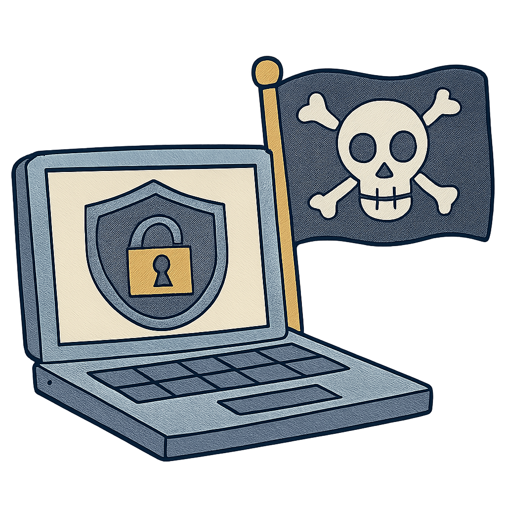

  
# 👋 Hi, welcome to my GitHub profile!

  

---

### 🙋‍♂️​ About Me
Driven by **curiosity** and **hands-on learning**, I began with networking and cybersecurity through **Cisco NetAcad courses**, then advanced my expertise through the **CyberHackAdemy at University of Federico II (Naples, IT)**, in partnership with **Accenture** and and endorsed by the **National Cybersecurity Agency** (**ACN**).

---

  
### 🛠️ Skills

| 🔧 Area                         | 🧰 Tools & Experience                                                                 |
|---------------------------------|----------------------------------------------------------------------------------------|
| 💻 **Programming & Scripting**      |   |
| 🖥️ **Operating Systems & Networking** |    |
| 🛡️ **Offensive Security & Pentesting** |         |
| 🔍 **Threat Intelligence & Analysis** |    |
| ☁️ **Virtualization & Cloud**        |     |
| 📡 **IoT & Wireless Security**       |   |
| 🤖 **AI & Machine Learning**         |     |
| ⚙️ **Automation & Security Orchestration** |    |
| 🧑‍💻 **Development & Collaboration**   |   |

---

  
### 📚​ Learning

  <!-- Cisco Badge -->
  
  
  <!-- Google Cloud Skills Boost Badge -->
  

  <!-- TryHackMe Badge -->
  
  

---

  ### 🎯 Interests

  
 - 🚩 **Capture The Flag (CTFs)**
 - 🤝 **Open-source security projects**
 - 🧠 **New cybersecurity challenges**  

---
 

  
> ## 📫 Always open to collaboration ⤵️
 

 

   
  
  
  

  

 

  

  
<picture>
  <source media="(prefers-color-scheme: dark)" srcset="https://raw.githubusercontent.com/LorenzoCammarano/LorenzoCammarano/output/pacman-contribution-graph-dark.svg">
  <source media="(prefers-color-scheme: light)" srcset="https://raw.githubusercontent.com/LorenzoCammarano/LorenzoCammarano/output/pacman-contribution-graph.svg">
  
</picture>

 _Generated with <a href="https://abozanona.github.io/pacman-contribution-graph/" target="_blank">abozanona/pacman-contribution-graph</a>_ 

